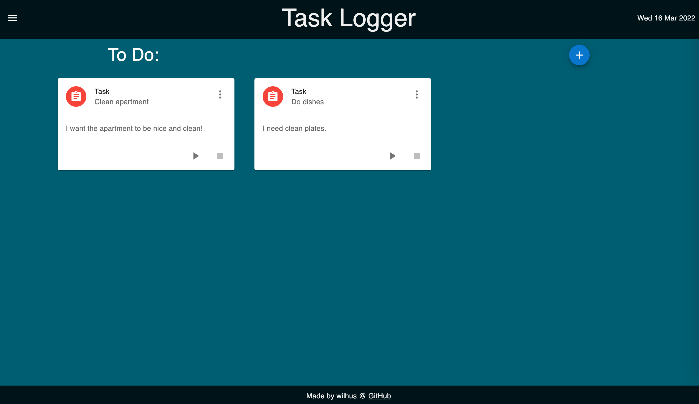
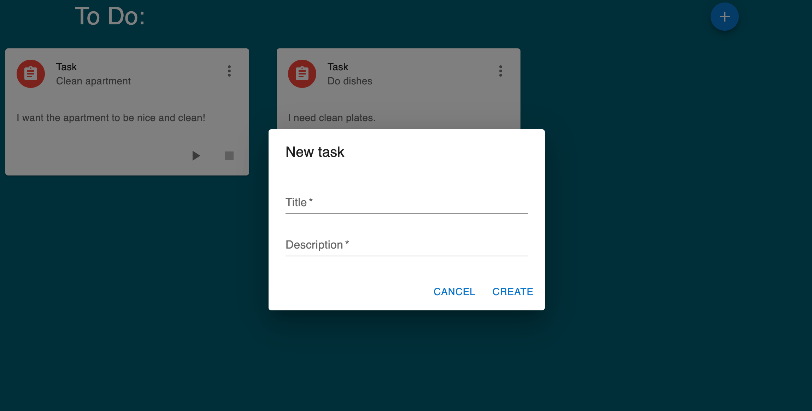

# Task Logger
This application helps you in organizing your daily tasks. The application provides a simple to do list and logs the time of all your tasks. You can use the calendar to find tasks from specific dates. The log shows when a task was created, started, ended, and its duration.

## Installation

TBD

## Made with
- [React.js](https://reactjs.org/)
- [Next.js](https://nextjs.org/)
- [SQLite](https://github.com/kriasoft/node-sqlite)
- [MUI](https://mui.com)

## Credits
Thanks to [@bmvantunes](https://github.com/bmvantunes) for the incredible Next.js tutorial. Check it out on [Youtube](https://www.youtube.com/watch?v=7J4iL1HDshQ&list=PLYSZyzpwBEWSQsrukurP09ksi49H9Yj40)

## License
MIT